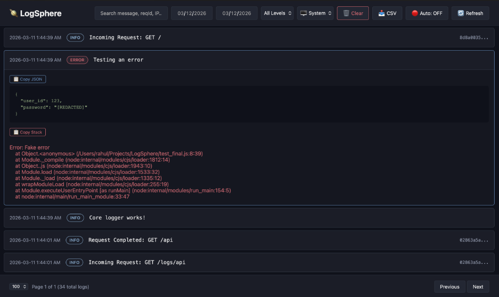
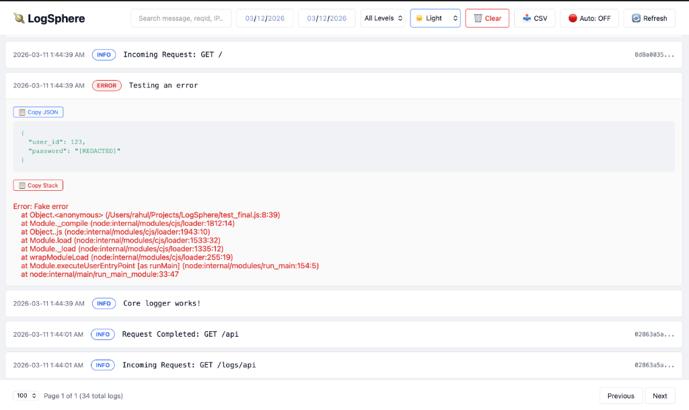

# 🪐 LogSphere

### Transparent, Resilient, and Beautiful Logging for Node.js & Express.

[](https://www.npmjs.com/package/logsphere)
[](https://opensource.org/licenses/MIT)

**LogSphere** is a zero-config-needed logging suite that gives you "Enterprise Grade" visibility without the complexity. It turns your messy terminal logs into a structured, searchable, and visual experience.

---

## ⚡️ The 30-Second Setup

Stop wrestling with configurations. LogSphere works out of the box.

```javascript
const express = require('express');
const { expressLogger, dashboard } = require('logsphere');

const app = express();

// 1. Log every request automatically
app.use(expressLogger({ logBody: true }));

// 2. See your logs in a beautiful UI at /dashboard
app.use('/dashboard', dashboard({ username: 'admin', password: '123' }));

app.listen(3000);
```

---

## 🔧 Configuration Methods

LogSphere uses a "Unified Config" system. Whether you use `configure()` or `expressLogger()`, you can pass the same set of options. 

### What's the difference?
*   **`configure(options)`**: Sets **Global Defaults**. This applies to everything (middleware, manual logs, dashboard).
*   **`expressLogger(options)`**: Sets **Local Overrides**. These settings apply *only* to that specific middleware instance, allowing you to have different logging rules for different API sections.

> [!NOTE]
> **Do I need both?**  
> `configure()` only sets the rules. To actually start capturing HTTP requests automatically, you **must** still add `app.use(expressLogger())` to your application.

```javascript
const { configure, expressLogger } = require('logsphere');

// 1. Set global rules (Applies everywhere)
configure({ 
  logDir: path.join(__dirname, 'logs'),
  logBody: true 
});

// 2. Use defaults
app.use(expressLogger()); 

// 3. Override for specific routes
app.use('/api/v2', expressLogger({ 
  logBody: false, // Turn off body logging just for V2
  slowRequestThresholdMs: 500 // Be stricter with performance here
}));
```

### 📋 Unified Options Table (Accepted by both)

| Option | Default | Description |
| :--- | :--- | :--- |
| `logDir` | `'./logs'` | Path to store logs (Absolute recommended). |
| `minLevel` | `'DEBUG'` | Min level: `DEBUG`, `INFO`, `WARN`, `ERROR`. |
| `logBody` / `logBodys` | `false` | Capture incoming `req.body`. |
| `logHeaders` / `logHeader` | `false` | Capture incoming request headers. |
| `logQuery` / `logQueries` | `true` | Capture URL query parameters. |
| `logResponse` | `false` | Capture outgoing response body. |
| `excludePaths` | `[]` | Array of path prefixes to skip from logging. |
| `sensitiveKeys` | `[...]` | List of keys to redact (Case-Insensitive). |
| `slowRequestThresholdMs` | `2000` | Flag requests exceeding this duration. |
| `maxExpireDays` | `false` | Auto-delete logs older than X days. |
| `discordWebhookUrl` | `null` | Target Discord Webhook for ERROR alerts. |
| `enableConsoleLogs` | `true` | Toggle the colorized terminal output. |

### 🚦 Log Level Hierarchy (minLevel)
The `minLevel` setting follows a strict hierarchy. When you set a minimum level, LogSphere captures that level **and everything above it**.

**DEBUG** (1) < **INFO** (2) < **WARN** (3) < **ERROR** (4)

*   `minLevel: 'INFO'`: Captures **INFO, WARN, and ERROR**. (Ignores Debug)
*   `minLevel: 'ERROR'`: Captures **only ERRORs**. (Best for quiet production)
*   `minLevel: 'DEBUG'`: Captures **Everything**. (Default for development)

---

## 🚀 Middleware & Dashboard

### `expressLogger(options)`
Zero-setup middleware. It automatically inherits from `configure()`, but you can pass local overrides if needed.

```javascript
app.use(expressLogger({ 
  logBody: false // Override global setting for this instance
}));
```

### `dashboard(options)`
Mounts the Web UI. Requires `username` and `password` for security.

```javascript
app.use('/dashboard', dashboard({
  username: 'admin',
  password: 'your-secure-password'
}));
```

---

## 🎨 Dashboard Preview

| 🌙 Dark Mode | ☀️ Light Mode |
| :---: | :---: |
|  |  |

---

## 🎨 Dashboard Experience

The dashboard is built for developers. No bulky setup—it's just a middleware.

- **Live Mode**: Click "Auto" and watch logs stream in as they happen.
- **Deep Search**: Filter by Request ID, IP Address, or status codes instantly.
- **Expandable Rows**: Click any log to see its metadata, body, and colorized stack traces.
- **Self-Healing**: If files are cleared/deleted, the logger re-creates them instantly.

---

## 🩺 Direct Logging & Levels

You can use LogSphere anywhere in your code, even outside of Express. Each method corresponds to a severity level and is color-coded in your terminal.

### Available Methods

| Method | Level | Terminal Icon | Best Use Case |
| :--- | :--- | :---: | :--- |
| `debug(msg, meta)` | `DEBUG` | 🐛 | High-volume technical details for development. |
| `info(msg, meta)` | `INFO` | ℹ️ | General app flow (Server start, user login). |
| `warn(msg, meta)` | `WARN` | ⚠️ | Important but non-critical issues (Low disk space). |
| `error(msg, err, meta)` | `ERROR` | ❌ | Critical failures. Triggers Discord alerts. |

### Implementation Examples

```javascript
const { debug, info, warn, error } = require('logsphere');

// 1. Simple Log
info("Server is listening on port 3000");

// 2. Log with Context Data (Meta)
debug("SQL Query executed", { duration: '12ms', query: 'SELECT * FROM users' });

// 3. Warning for non-blocking issues
warn("API Rate limit reached for IP: 1.2.3.4");

// 4. Critical Errors (Captures Stack Trace)
try {
  throw new Error("Payment Gateway Timeout");
} catch (err) {
  // Pass the error object as the 2nd argument to capture the full stack trace
  error("Transaction failed", err, { transactionId: 'TX_998' });
}
```

---

- **Found a bug?** Open an [Issue](https://github.com/rahulroynipon/LogSphere/issues).

### 🏷️ Author & Maintenance
**Rahul Roy Nipon**
- 📧 **Email**: [rahulroynipon@gmail.com](mailto:rahulroynipon@gmail.com)
- 🔗 **LinkedIn**: [linkedin.com/in/rahulroynipon](https://linkedin.com/in/rahulroynipon)
- 🐙 **GitHub**: [github.com/rahulroynipon](https://github.com/rahulroynipon)

MIT License © 2026 Rahul Roy Nipon
